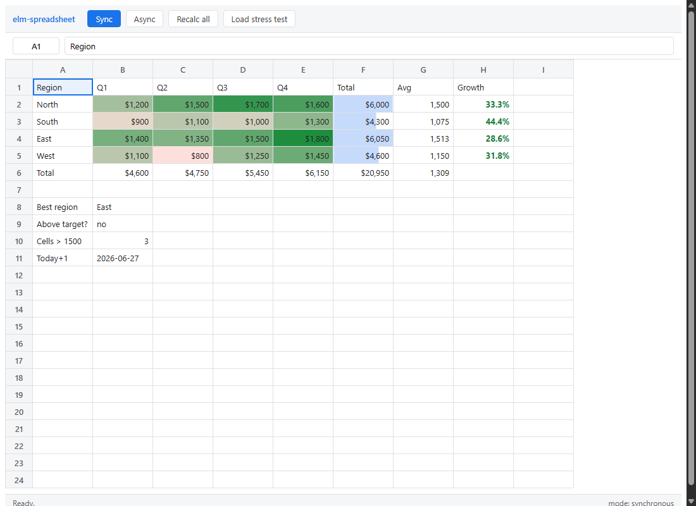

# elm-spreadsheet

A spreadsheet **logic and view layer** in Elm (built for the [elm-lang](../../) compiler).
It gives you a recalculating cell engine — values, a wide formula function library,
number formats, and conditional styling — plus a class-styled HTML grid to render it. The
engine is pure and effect-free, so it is fully unit-tested without a browser.



## Highlights

- **Cell values & formulas.** Numbers, text, booleans, blanks and the standard `#…!`
  errors. A hand-written formula parser with Excel/Sheets semantics: operator precedence
  (`-2^2 = 4`, right-associative `^`), `&` concatenation, `%` postfix, `$` absolute refs,
  ranges (`A1:B5`).
- **~100 functions** across every category — math/trig (`SUM`, `ROUND`, `MOD`, `POWER`,
  `SIN`, `GCD`, …), statistics (`AVERAGE`, `MEDIAN`, `STDEV`, `COUNTIF`, `SUMIF`,
  `LARGE`, …), logical (`IF`, `IFS`, `IFERROR`, `SWITCH`, `AND`/`OR`, …), text (`LEFT`,
  `MID`, `SUBSTITUTE`, `TEXTJOIN`, `TEXT`, …), lookup (`VLOOKUP`, `HLOOKUP`, `INDEX`,
  `MATCH`, `CHOOSE`), information (`ISNUMBER`, `ISERROR`, `TYPE`, …) and date
  (`DATE`, `YEAR`, `WEEKDAY`, `DAYS`, …). Lazy forms (`IF`/`IFERROR`) don't evaluate the
  untaken branch; aggregates propagate errors and ignore text in ranges, as Excel does.
- **Formatting.** `General`, `Number`, `Currency`, `Percent`, `Scientific`, `DateTime`
  and raw `Custom` Excel-style format codes (`#,##0.00`, `0.0%`, `yyyy-mm-dd`), shared
  with the `TEXT()` function.
- **Conditional & value styling.** Static cell styles — bold/italic/underline/strike,
  alignment, font family & size, text and fill colour — plus conditional-format **rules**
  (greater-than, between, text-contains, COUNTIF-style criteria, …), two-colour **scales**
  and **data bars**. Styling is expressed as **CSS classes** by default (so a host can
  restyle everything — the demo includes a Solarized-beige theme); only data-driven values
  (colour, font, size, bar widths) are emitted inline. A `with*/toggle*/…Of` API on
  `Style` backs a Word-style formatting toolbar in the demo.
- **Sync *and* async recalculation.** `recalcAll`/`recalcFrom` recompute synchronously in
  dependency order (with circular-reference detection → `#CIRC!`). For very large sheets,
  `Spreadsheet.Recalc` slices the same work into per-frame **batches** and computes the
  **visible viewport first**, so the page never freezes.

## Layout

```
src/Spreadsheet/
  Value.elm      cell values, coercions, comparison
  Ref.elm        A1 addressing, ranges
  Ast.elm        formula syntax tree
  Parser.elm     tokenizer + precedence-climbing parser
  Functions.elm  the built-in function library
  Eval.elm       evaluator (operators, lazy/reference-aware forms)
  Deps.elm       precedent extraction + topological sort
  Format.elm     number/date formatting + format-code interpreter
  Style.elm      cell styles, conditional rules, colour scales, data bars
  Sheet.elm      the (opaque) sheet model + synchronous recalc engine
  Recalc.elm     async, visible-first incremental recalculation
  View.elm       the class-styled HTML grid
src/Main.elm     a demo app (editing, formula bar, sync/async toggle)
src/spreadsheet.css   the default stylesheet (all ss-* classes)
test/SpreadsheetTest.elm   362 tests
```

The engine knows nothing about the DOM; `View`/`Main` are the only modules that import
`Html`. `Sheet` is opaque — callers use its functions, never its fields.

## Using the library

```elm
import Spreadsheet.Sheet as Sheet
import Spreadsheet.Ref as Ref

sheet =
    Sheet.empty 100 26
        |> Sheet.setRawMany
            [ ( cell "A1", "10" )
            , ( cell "A2", "20" )
            , ( cell "A3", "=SUM(A1:A2)*2" )
            ]
        |> Sheet.recalcAll

result =
    Sheet.displayString (cell "A3") sheet  -- "60"

cell a =
    Maybe.withDefault { col = 0, row = 0 } (Ref.fromA1 a)
```

To render it, hand a `Spreadsheet.View.Config` (viewport size, selection, edit buffer and
message callbacks) to `Spreadsheet.View.view`.

### Async recalculation

```elm
( sheet1, state ) =
    Recalc.begin viewport [ changedRef ] sheet0   -- or Recalc.beginAll for a full pass

-- one batch per animation frame:
( sheet2, state2 ) =
    Recalc.step 64 state sheet1
-- …until Recalc.isDone state
```

`begin`/`beginAll` take a `Viewport`; the visible cells (and the precedents they need)
are moved to the front of the dependency-ordered queue, so the on-screen region settles
in the first frame or two while off-screen cells finish in the background.

## Build & test

```bash
ELM=../../elm.sh ./build.sh    # → build/elm-spreadsheet.html  (standalone, CSS inlined)
ELM=../../elm.sh ./test.sh     # → 362 pure-engine tests
```

`build.sh` post-processes the compiler's output to add a viewport meta tag and inline
`src/spreadsheet.css`, so the result is a single self-contained HTML file.

## Notes & simplifications

- Dates use a clean proleptic-Gregorian serial model where `DATE(1900,1,1) = 1`; it omits
  Excel's historical 1900-leap-year bug, so serials differ from Excel by one day after
  February 1900.
- A bare range used where a single value is expected collapses to its top-left cell
  (rather than spilling/array-broadcasting).
- `SUBSTITUTE`'s optional instance argument and a few other deep Excel corners are
  documented simplifications.
